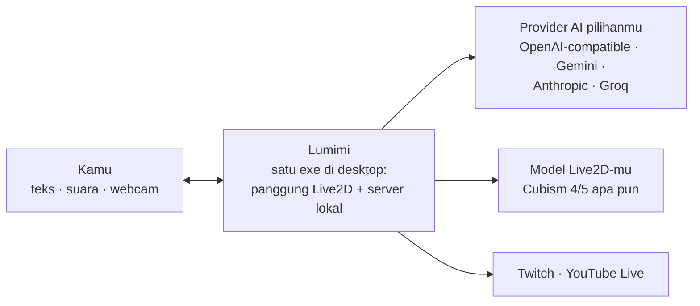

<p align="center">
  
</p>

# Lumimi

> **English version: [`README.md`](README.md).**

> Teman Live2D di desktop-mu: dia mengobrol, bergerak, bersuara, dan tetap hidup saat kamu sibuk.

Lumimi menghidupkan model Live2D jadi teman yang bisa diajak bicara. Kamu ketik atau bicara,
dia menjawab dengan suara sambil menggerakkan badan, dan saat kamu
pergi dia tetap melakukan sesuatu: bergumam sendiri, menyapa saat kamu kembali. Semua jalan di satu aplikasi kecil di mesinmu sendiri.

## Apa yang bikin Lumimi berbeda

**Model Live2D apa pun jadi.** Punya file `.model3.json` Cubism 4 atau 5? Impor foldernya,
Lumimi yang cari tahu kemampuan modelmu sendiri. Tidak ada penyetelan per model, tidak ada
daftar nama yang didukung.

**Aktingnya ikut isi obrolan.** Jawabannya bukan teks datar. Kalau dia bilang senang, badannya
ikut senang; kalau malu, tatapannya kabur. Kamu bisa atur seberapa ekspresif dia per sendi.

**Dia benar-benar bisa bertindak.** Selain jadi teman ngobrol, Lumimi punya mode asisten yang
boleh membaca file, mencari kode, sampai menjalankan perintah di komputermu. Yang bersifat
mengubah selalu minta izinmu dulu lewat kartu persetujuan, dan setiap langkah bisa dibatalkan.

**Suaranya lokal.** Dia bicara lewat mesin suara bawaan yang jalan di prosesmu sendiri, dan
mendengar lewat pengenalan suara yang sama-sama lokal. Tidak ada butuh langganan cloud khusus
buat bisa diajak ngobrol pakai suara.

**Kameramu tetap milikmu.** Deteksi mood dari webcam dihitung sepenuhnya di browser. Frame
kamera dan suara mic tidak pernah dikirim ke mana pun.

## Tiga cara pakai

- **AI VTuber.** Sambungkan ke chat Twitch atau YouTube Live, dan Lumimi jadi pembawa acara
  yang membaca komentar dan membalas sambil akting. Ada overlay untuk OBS.
- **Asisten.** Panel kerja ala agentic: dia menyusun rencana, memakai tool, dan melaporkan
  hasilnya. Kamu mengawasi dan menyetujui langkah yang berisiko.
- **Desktop pet.** Jendela transparan yang selalu di atas. Dia cuma
  duduk manis di pojok layar.

Satu aplikasi, pindah peran cukup sekali klik, tanpa restart.

## Cara kerjanya

Semua hidup di **satu file aplikasi**: panggung Live2D dan server otaknya dalam satu proses,
tanpa instal runtime lain. Server itu menghubungkan tiga hal: model Live2D pilihanmu, provider
AI yang kamu tentukan sendiri (OpenAI-compatible, Gemini, Anthropic, Groq), dan perangkat
kamu: keyboard, mic, kamera. Koneksi keluar cuma ke tempat yang kamu izinkan.



Pengaturan, model, sheet, dan motion-mu tersimpan di folder `data/` milikmu. Pindah
komputer? Copy foldernya, selesai.

## Dapatkan Lumimi

Saat ini Lumimi tersedia untuk **Windows**. Cara termudah: bangun folder portable sendiri
sekali, lalu pakai atau bagikan hasilnya.

```bash
bun install
bun run build          # siapkan aset + bundle aplikasi
bun run dist           # hasil: folder portable di dist/ + installer opsional
```

`bun run dist` menghasilkan folder portable berisi satu `Lumimi.exe` plus installer
per-user tanpa admin bila Inno Setup 6 terpasang. Aplikasi butuh WebView2, yang
biasanya sudah ada di Windows 10/11.

## Jalankan dari source

Butuh [Bun](https://bun.sh) dan Rust toolchain.

```bash
bun install
bun run build
bun run dev            # buka http://127.0.0.1:8310 di browser
```

Build pertama mengunduh Cubism Core resmi dari CDN Live2D (kode proprietary mereka, diatur
lisensinya sendiri, tidak ikut di-commit).

## Privasi, garis besarnya

- Semua koneksi default terikat ke loopback; tidak ada port yang terbuka ke jaringan.
- Frame webcam tidak pernah di-upload; deteksinya jalan lokal.
- Suara mic diproses lokal; layanan cloud cuma dipakai kalau kamu memilihnya sendiri.
- API key-mu tersimpan lokal dan tidak pernah disajikan lewat HTTP.
- Langkah asisten yang mengubah file atau menjalankan perintah selalu butuh persetujuan.

## Lisensi

| Komponen | Lisensi |
|---|---|
| Kode Lumimi | mengikuti ketentuan pemilik repo |
| PixiJS 8 | MIT |
| Cubism Core | Live2D Proprietary, diunduh terpisah saat build |
| Cubism Framework | Live2D Open Software License |
| Model Live2D | milik pembuat masing-masing model |

## Buat kontributor

Panduan kerja untuk manusia maupun AI agent ada di [`AGENTS.md`](AGENTS.md), dan aturan-aturan
mengikat lainnya di folder [`docs/`](docs/). Baca di sana sebelum menyentuh kode.
