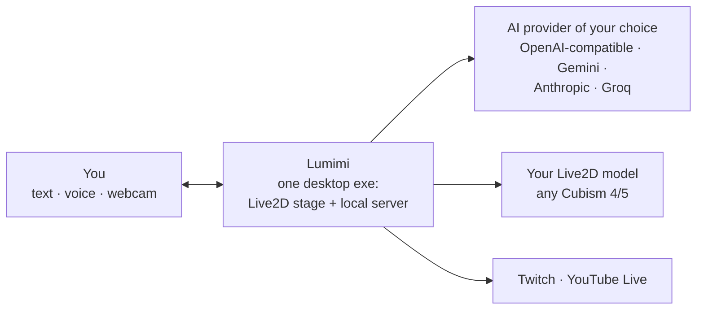

<p align="center">
  
</p>

# Lumimi

> Your Live2D friend on the desktop: she chats, moves, speaks, and stays alive while you're busy.
>
> 🇮🇩 Versi Bahasa Indonesia: [`README-ID.md`](README-ID.md).

Lumimi turns a Live2D model into a friend you can talk to. You type or speak,
she answers out loud while moving her body, and when you walk away she keeps
doing things: mumbling to herself, greeting you when you're back. Everything
runs in one small app on your own machine.

## What makes Lumimi different

**Any Live2D model works.** Have a Cubism 4 or 5 `.model3.json` file? Import its
folder and Lumimi figures out the model's capabilities on her own. No per-model
tuning, no list of supported names.

**Her acting follows the conversation.** Her replies aren't flat text. When she
says she's happy, her body is happy too; when she's shy, her gaze drifts away.
You can tune how expressive she is per joint group.

**She can actually do things.** Beyond chatting, Lumimi has an assistant mode
that may read files, search code, and run commands on your computer. Anything
mutating always asks your permission first through an approval card, and every
step can be undone.

**Her voice is local.** She speaks through a built-in voice engine running in
her own process, and listens through equally local speech recognition. No
special cloud subscription needed to talk to her by voice.

**Your camera stays yours.** Webcam mood detection is computed entirely in the
browser. Camera frames and mic audio are never sent anywhere.

## Three ways to use her

- **AI VTuber.** Connect to Twitch or YouTube Live chat and Lumimi becomes a host
  that reads comments and replies while acting. Includes an overlay for OBS.
- **Assistant.** An agentic work panel: she makes plans, uses tools, and reports
  results. You supervise and approve the risky steps.
- **Desktop pet.** A transparent always-on-top window. She just sits
  pretty in the corner of your screen.

One app; switching roles takes one click, no restart.

## How it works

Everything lives in **one application binary**: the Live2D stage and her brain
server in a single process, no extra runtime to install. That server connects
three things: the Live2D model of your choice, the AI provider you pick yourself
(OpenAI-compatible, Gemini, Anthropic, Groq), and your devices: keyboard, mic,
camera. Outbound connections only go where you allow.



Your settings, models, sheets, and motions live in your own `data/` folder.
Switching computers? Copy the folder, done.

## Get Lumimi

Lumimi is currently available for **Windows**. The easiest way: build the
portable folder yourself once, then use or share the result.

```bash
bun install
bun run build          # prepare assets + app bundle
bun run dist           # output: portable folder in dist/ + optional installer
```

`bun run dist` produces a portable folder with a single `Lumimi.exe`, plus a
per-user no-admin installer when Inno Setup 6 is installed. The app needs
WebView2, which is usually already on Windows 10/11.

## Run from source

Requires [Bun](https://bun.sh) and the Rust toolchain.

```bash
bun install
bun run build
bun run dev            # open http://127.0.0.1:8310 in a browser
```

The first build downloads the official Cubism Core from the Live2D CDN (their
proprietary code, under its own license, never committed).

## Privacy, in short

- All default connections bind to loopback; no port is exposed to the network.
- Webcam frames are never uploaded; detection runs locally.
- Mic audio is processed locally; cloud services are only used if you opt in.
- Your API keys are stored locally and never served over HTTP.
- Assistant steps that modify files or run commands always need approval.

## License

| Component | License |
|---|---|
| Lumimi code | per the repo owner's terms |
| PixiJS 8 | MIT |
| Cubism Core | Live2D Proprietary, downloaded separately at build |
| Cubism Framework | Live2D Open Software License |
| Live2D models | belong to their respective creators |

## For contributors

The working guide for humans and AI agents is in [`AGENTS.md`](AGENTS.md), with
further binding rules in [`docs/`](docs/). Read them before touching code.

> **A note on language:** the working docs (`AGENTS.md`, `docs/`) are written in
> Indonesian — that is the maintainer's working language. English issues,
> discussions, and PRs are welcome; machine translation is perfectly fine for
> reading the docs.
